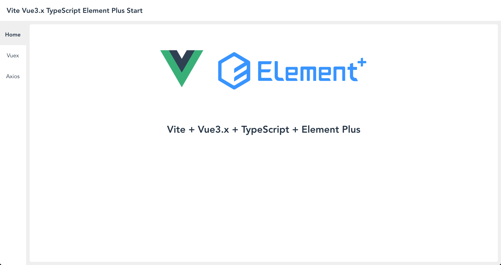

# Vite-Vue3.x-TypeScript-ElementPlus-Starter 



## Technology stack
- [x] TypeScript
- [x] Vite v2.x
- [x] Vue v3.x
- [x] Vue Router v4.x
- [x] Vuex v4.x
- [x] Element Plus
- [x] Stylus
- [x] Axios

## Get start

### Project setup

```sh
npm install
# or
yarn add
```
### Compiles and hot-reloads for development


```sh
npm run dev
```

### Compiles and minifies for production
```sh
npm run build
```

## License

MIT Copyright © 2021 XPoet

