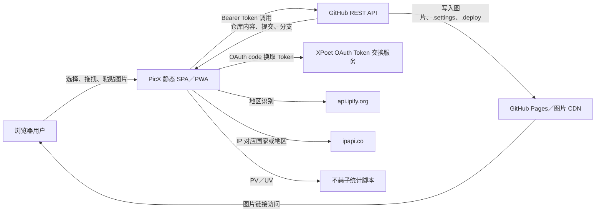
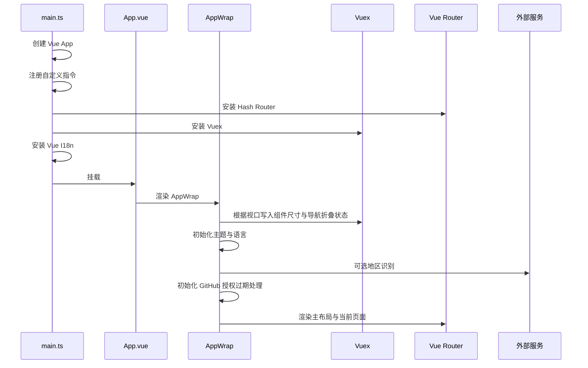
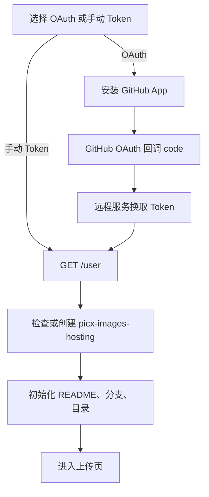

# PicX 现状架构文档

## 1. 文档信息

- 文档类型：现状架构说明。
- 分析基线：`dev` 分支，提交 `500f260`。
- 分析日期：2026-07-31。
- 项目版本：`3.0.2`。
- 适用范围：当前仓库中的 Web 前端、GitHub 图床能力、图片工具箱、PWA 和部署流程。

本文只描述当前代码已经存在的结构。目标插件架构见 [PLUGIN-PLATFORM-REFACTOR-PLAN.md](./PLUGIN-PLATFORM-REFACTOR-PLAN.md)，技术升级目标见 [TECH-STACK-UPGRADE-PLAN.md](./TECH-STACK-UPGRADE-PLAN.md)。

## 2. 架构摘要

PicX 当前是一个部署为静态资源的 Vue 3 单页应用。浏览器既承担 UI，也承担图片读取、压缩、水印、Base64 转换、状态持久化和 GitHub API 调用。

系统没有独立业务后端。唯一与认证有关的远程服务是 OAuth code 换取 Token 的 `https://apis.xpoet.cn/api/github-authorize`。图床数据、配置文件和部署状态主要存储在用户的 GitHub 仓库中；浏览器本地存储保存 Token、用户配置、工具设置和目录缓存。

当前“图床”和“工具箱”不是两个独立领域：

- 上传前压缩、水印会复用工具算法和配置组件。
- GitHub 用户、仓库、目录、链接规则、部署状态分散在多个全局 Vuex 模块中。
- 工具箱通过静态数组和静态子路由注册三个工具。
- 工具组件直接使用共享 Vuex Store、通用上传组件和全局 Element Plus API。

因此，当前系统属于“以 GitHub 图床流程为中心、附带若干图片工具”的单体前端，而不是图片工具插件平台。

## 3. 系统上下文



### 3.1 信任边界

| 边界           | 当前行为                                                 | 主要风险                                        |
| -------------- | -------------------------------------------------------- | ----------------------------------------------- |
| 浏览器本地存储 | Token、授权状态、用户配置、图片目录缓存写入 LocalStorage | XSS 会扩大为 Token 泄露；大目录可能超过存储限额 |
| GitHub API     | 浏览器直接携带 Token 调用                                | Token 权限过大、限流和网络失败直接影响页面      |
| OAuth 服务     | code 和 redirect URI 发送到远程服务换取 Token            | 服务可用性及隐私策略需要独立说明                |
| 第三方地区服务 | 公网 IP 被提交给地区查询服务                             | 隐私、跨境请求和服务失效                        |
| 第三方统计脚本 | 运行时向页面注入远程脚本                                 | CSP、供应链和离线可用性风险                     |
| PWA 缓存       | Service Worker 自动更新静态资源                          | 旧缓存与新运行时代码不一致                      |

## 4. 技术与运行时

### 4.1 当前依赖基线

`package.json` 中的版本声明和 `pnpm-lock.yaml` 中的解析版本并不完全相同。以下“当前解析版本”来自锁文件对应的实际安装基线：

| 层次       | 当前技术                                                        |
| ---------- | --------------------------------------------------------------- |
| 运行时框架 | Vue `3.3.4`、Vue Router `4.2.4`、Vuex `4.1.0`、Vue I18n `9.2.2` |
| UI         | Element Plus `2.3.7`、Iconify Element Plus 图标                 |
| 网络       | Axios `1.4.0`                                                   |
| 图片压缩   | `@yireen/squoosh-browser` `1.0.7`                               |
| 构建       | Vite `2.7.13`、`@vitejs/plugin-vue` `2.3.4`                     |
| 类型       | TypeScript `4.9.5`，当前没有 `vue-tsc` 类型检查脚本             |
| 样式       | Stylus `0.59.0`、Stylelint `15.10.2`                            |
| PWA        | vite-plugin-pwa `0.12.8`                                        |
| 工程规范   | ESLint `7.32.0`、Prettier `2.8.8`、Husky `6.0.0`                |
| 包管理     | `packageManager` 声明 pnpm `7.33.7`                             |

### 4.2 启动流程



`src/views/app-wrap/app-wrap.vue` 同时承担 Element Plus 全局配置、响应式尺寸、主题、语言、地区识别和授权初始化，职责较重。

### 4.3 页面外壳

页面外壳由三层组成：

1. `App.vue`：只渲染 `AppWrap`。
2. `app-wrap.vue`：提供 Element Plus locale、size、z-index，并执行全局初始化。
3. `main-container.vue`：固定顶部 Header、左侧导航和右侧 `router-view` 内容区。

现有布局采用满视口固定高度：

- 顶栏高度：`60rem`。
- 展开侧栏宽度：`240rem`。
- 折叠侧栏宽度：`86rem`。
- 主内容区由 `.page-container` 自己滚动。
- Stylus 通过 `:root { font-size: 1px }` 把 `rem` 当成缩放后的像素单位。

## 5. 代码目录

```text
src/
├── App.vue
├── main.ts
├── common/
│   ├── api/                 # GitHub 用户、仓库、分支、目录、上传、删除、提交
│   ├── constant/            # API、Storage、设置和初始化常量
│   ├── directive/           # 右键菜单、目录 SHA、重命名目录
│   └── model/               # 图片、用户配置、设置、工具等 TypeScript 模型
├── components/
│   ├── tools/               # 压缩、Base64、水印和处理结果卡片
│   └── ...                  # Header、导航、上传入口、配置、状态条等共享组件
├── locales/                 # zh-CN.json、zh-TW.json、en.json
├── plugins/
│   ├── vite/                # 自动导入、图标、更新通知、PWA
│   └── vue/                 # Vue I18n
├── router/index.ts          # 静态路由表和标题守卫
├── stores/
│   ├── index.ts             # Vuex 根 Store
│   └── modules/             # 9 个全局模块
├── styles/                  # 全局变量、主题、Element Plus 覆盖和基础样式
├── utils/
│   ├── request/             # Axios 单例和统一请求包装
│   └── ...                  # 图片、上传、文件、链接、存储、系统工具
└── views/                   # 路由页面
```

## 6. 路由与信息架构

路由采用 `createWebHashHistory()`。除 `/config` 使用动态导入外，其余主要页面和三个工具均在首屏静态导入。

| 路径                 | 页面／组件            | 访问条件                 | 职责                                         |
| -------------------- | --------------------- | ------------------------ | -------------------------------------------- |
| `/`                  | `picx-login.vue`      | 公开                     | OAuth 或 Token 登录，已登录时自动跳转        |
| `/config`            | `picx-config.vue`     | 公开                     | Token、用户、仓库和目录配置                  |
| `/upload`            | `upload-image.vue`    | 页面内校验配置           | 选图、上传前处理、单张或批量提交 GitHub      |
| `/management`        | `imgs-management.vue` | 导航点击时校验仓库和目录 | 目录浏览、图片预览、选择、复制、删除、重命名 |
| `/settings`          | `picx-settings.vue`   | 登录后显示导航           | 图片命名、压缩、水印、链接、部署、主题       |
| `/toolbox`           | `picx-toolbox.vue`    | 公开                     | 静态工具卡片目录                             |
| `/toolbox/compress`  | `compress-tool.vue`   | 公开                     | 浏览器本地批量压缩                           |
| `/toolbox/base64`    | `base64-tool.vue`     | 公开                     | 图片转 Base64                                |
| `/toolbox/watermark` | `watermark-tool.vue`  | 公开                     | 浏览器本地批量加文字水印                     |
| `/feedback`          | `feedback-info.vue`   | 公开                     | 项目、文档、作者和赞赏信息                   |
| 其他                 | 重定向 `/`            | 公开                     | 兜底                                         |

当前没有统一路由权限守卫。登录和配置约束散落在登录页、导航点击处理和上传页提交逻辑中。直接输入受限路由时，页面依赖自己的防御逻辑。

## 7. 状态与持久化

### 7.1 Vuex 模块

当前模块都未启用 `namespaced`，因此 Action 和 Mutation 名称处于全局命名空间。

| 模块                 | 核心状态                                 | 持久化                                  | 使用者                     |
| -------------------- | ---------------------------------------- | --------------------------------------- | -------------------------- |
| `github-authorize`   | OAuth 安装、授权、Token、code、过期时间  | `PICX_AUTHORIZATION`                    | 登录、授权过期处理         |
| `user-config-info`   | Token、用户、仓库、分支、目录、登录状态  | `PICX_CONFIG`                           | 配置、上传、管理、API      |
| `user-settings`      | 文件名、压缩、水印、链接规则、主题、语言 | `PICX_SETTINGS`、`PICX_GLOBAL_SETTINGS` | 上传、设置、外壳、链接生成 |
| `upload-image-list`  | 图床上传队列与处理状态                   | 内存                                    | 上传页面                   |
| `toolbox-image-list` | 工具箱共用图片处理列表                   | 内存                                    | 压缩、Base64、水印         |
| `dir-image-list`     | 仓库目录树和图片缓存                     | `PICX_MANAGEMENT`                       | 图片管理、上传后回填       |
| `image-card`         | 当前目录图片卡片与选中项                 | 内存                                    | 管理页批量操作             |
| `upload-area`        | 上传区激活、粘贴、Shift、右键菜单对象    | 内存                                    | 上传、管理、自定义指令     |
| `deploy-status`      | GitHub Pages 部署状态                    | GitHub 仓库 `.deploy`                   | Header 初始化、上传、设置  |

### 7.2 GitHub 仓库内配置

| 文件        | 用途                                         | 写入方式                         |
| ----------- | -------------------------------------------- | -------------------------------- |
| `.settings` | 云端同步用户图片设置                         | GitHub Contents API，Base64 JSON |
| `.deploy`   | GitHub Pages 部署状态                        | GitHub Contents API，Base64 JSON |
| `README.md` | 初始化空仓库，允许后续 Git database API 操作 | GitHub Contents API              |

当前 `.settings` 和 `.deploy` 没有显式 schemaVersion。未来变更结构时无法可靠判断迁移路径。

## 8. 核心业务流

### 8.1 登录与自动配置



主要实现：

- `src/views/picx-login/picx-login.util.ts`
- `src/views/picx-config/picx-config.util.ts`
- `src/common/api/user.ts`
- `src/common/api/repo.ts`

### 8.2 图片上传

选图入口 `getting-images.vue` 统一处理文件选择、拖拽和粘贴，输出 `{ uuid, base64, file }`。上传页将其转换为 `UploadImageModel`。

上传前处理顺序在 `upload-image-card.util.ts` 中触发，最终上传内容按以下优先级选择：

```text
compressBase64 → watermarkBase64 → originalBase64
```

这表示压缩结果优先于水印结果。该模型不能表达“先压缩、再水印”形成的完整可组合流水线，是插件平台改造必须解决的核心限制。

单张上传：

1. 生成 GitHub Contents API 路径。
2. `PUT /repos/{owner}/{repo}/contents/{path}`。
3. 回填上传状态和目录树。
4. 自动复制图片链接。

批量上传：

1. 每张图片创建 Git blob。
2. 获取目标分支 head。
3. 创建 tree。
4. 创建 commit。
5. 更新 branch ref。
6. 回填每张图片状态并批量复制链接。

### 8.3 图片管理

图片管理把 GitHub 目录递归组织为本地 `DirObject` 树：

- 目录和图片按需从 GitHub Contents API 获取。
- 结果写入 Vuex 并缓存到 LocalStorage。
- 当前目录渲染文件夹卡片和图片卡片。
- 自定义右键指令在 `document.body` 动态创建菜单。
- 删除、重命名、复制链接和查看属性依赖全局 Store 及页面工具函数。

目录重命名和目录删除在右键菜单中仍是 TODO。

### 8.4 图片工具箱

三个工具共享以下结构：

1. `getting-images.vue` 读取图片。
2. 把图片写入 `toolboxImageListModule`。
3. 左侧渲染 `img-process-state-card.vue`。
4. 右侧显示输入区、配置和操作按钮。
5. 算法在主线程串行执行。

差异：

| 工具          | 算法                                                | 输出                                    |
| ------------- | --------------------------------------------------- | --------------------------------------- |
| 图片压缩      | `@yireen/squoosh-browser`，支持 WebP、MozJPEG、AVIF | 新 File、Base64、批量下载               |
| 图片转 Base64 | `FileReader`                                        | 复制 Data URL                           |
| 图片水印      | Canvas 2D 文字绘制                                  | 保持原 MIME 的新 File、Base64、批量下载 |

当前工具注册由三处静态代码共同决定：

- `picx-toolbox.data.ts`：卡片元数据。
- `router/index.ts`：子路由。
- 对应组件目录：具体实现。

新增工具必须同时修改多处，且没有 manifest、权限、依赖、生命周期、错误隔离和动态停用能力。

## 9. 构建、PWA 与部署

### 9.1 Vite

- `base: './'`，适配相对路径静态部署。
- 别名 `@` 指向 `/src`。
- 自动导入 Element Plus API、组件和图标。
- 生产构建使用 Terser，删除 `console.log` 和 `debugger`。
- 生产模式且 `VITE_USE_PWA` 为真时注册 PWA。
- `@yireen/squoosh-browser` 被排除在依赖预构建之外。

### 9.2 PWA

- `registerType: 'autoUpdate'`。
- `injectRegister: 'auto'`。
- Workbox `skipWaiting: true`。
- manifest 提供 192 和 512 图标。

当前风险：

- 512 图标条目的 `sizes` 仍写为 `192x192`。
- `skipWaiting` 可能让运行中页面使用新旧资源混合，需要更新提示与刷新策略配合。
- 没有插件资源、远程插件 manifest 或图片作业缓存的专项策略。

### 9.3 GitHub Actions

当前 `deploy.yml`：

- 仅监听 `master`。
- 使用 `actions/checkout@v2`、`actions/setup-node@v2`。
- Node.js 16。
- `npm install --legacy-peer-deps`。
- `npm run build`。
- `peaceiris/actions-gh-pages@v3` 发布 `dist`。

它与仓库声明的 pnpm 7 不一致，且 Node.js 16 已结束支持，是技术升级第一阶段必须修复的基础设施问题。

## 10. 现有优点

- 纯前端部署，运维成本低。
- GitHub 仓库既是图片存储又是用户可掌控的数据源。
- 单张和批量上传分别针对 GitHub Contents API 与 Git database API 做了优化。
- 图片工具均在浏览器本地执行，原图不必上传第三方处理服务。
- 已有明暗主题、多语言、PWA、移动端断点和自动导入。
- 页面与组件已按业务目录拆分，具备继续模块化的基础。

## 11. 主要架构债务

### 11.1 高优先级

1. GitHub Token 明文持久化到 LocalStorage，认证与通用用户配置混在一起。
2. 没有类型检查、单元测试或端到端测试门禁。
3. CI 使用 EOL Node.js 16 和 npm，与本地 pnpm 契约冲突。
4. 压缩库自 2022 年后未更新，且源码导入其私有深层路径。
5. 工具箱不是插件系统，无法满足热插拔要求。
6. 图片处理在主线程串行运行，大图和批量任务可能阻塞交互。
7. 路由权限控制分散，直接访问路径时行为不一致。

### 11.2 中优先级

1. View、Store、API 和 utils 之间存在反向依赖，例如 Store 依赖 View 工具函数。
2. Vuex 模块未命名空间化，Action 名称容易冲突。
3. 多处通过 `computed(...).value` 截取非响应式对象，再直接修改深层属性。
4. 多处使用 `any`、`@ts-ignore`、索引 key、Props 直接变更。
5. 自定义右键菜单直接拼接 HTML、操作 DOM 和注册全局事件，生命周期难以验证。
6. 工具组件存在大量重复布局和重复队列逻辑。
7. 上传结果模型使用 `finial*` 拼写，公共契约不统一。
8. 图片结果大量使用 Base64，内存占用通常高于 Blob／对象 URL。

### 11.3 UI 债务

1. 顶部 Header、左侧导航、工具卡片和工具工作区缺少统一的产品层级。
2. 关键操作常依赖 Hover 才显示，移动端与键盘体验不足。
3. 工具工作区只做左右两栏，配置、预览、批量队列的优先级不清晰。
4. 设置页用单层折叠面板承载所有内容，图床专属设置与平台设置混合。
5. `rem` 作为“缩放像素”的方案产生非标准心智模型，且断点重复。
6. 部分反馈页使用 Emoji 作为结构图标，与图标体系不一致。

## 12. 演进原则

后续演进必须遵循以下顺序：

1. 先建立可重复构建、类型检查和测试基线。
2. 再抽取图片资产、处理任务、通知、存储、下载等平台服务。
3. 将压缩、水印、Base64 转为内置工具插件。
4. 把 GitHub 认证、上传、图库、链接和部署整体迁入图床插件。
5. 建立插件注册、权限、生命周期、隔离和失败恢复。
6. 在稳定契约之上实施新 UI，不让视觉重构掩盖业务迁移错误。
7. 最后开放第三方运行时插件。

每一阶段都必须保持现有核心链路可用：登录、配置、上传、管理、复制链接和本地图片处理。
